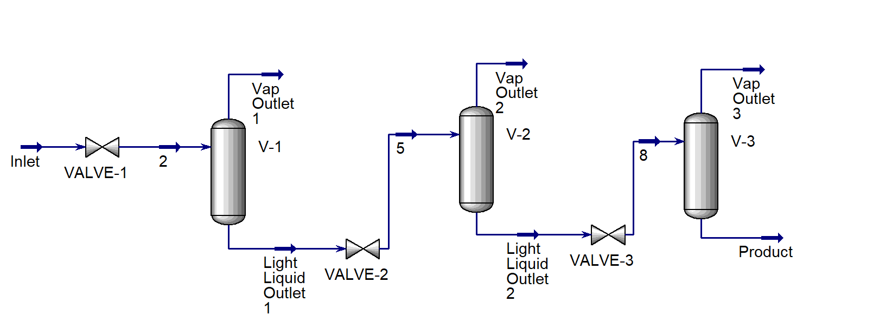

# Three-stage separator train for condensate stabilisation, modelled in Aspen HYSYS

## Overview

Before the condensate from the high-pressure upstream separator can be stored it has to undergo stabilisation. The condensate contains light hydrocarbons which give it a vapour pressure above atmospheric so it boils in the storage tank thus raising the pressure and creating a major fire hazard and risk of explosion. The lighter hydrocarbons such as methane and ethane are the main issue and hydrocarbons such as n-pentane have little effect. Stabilisation is the fix to this issue by flashing the light hydrocarbons into a gas which can then be removed leaving the condensate consisting of the heavier hydrocarbons. This flash is done in stages as a single pressure drop would remove the valuable heavier components along with the lighter components.

## Design Basis

The feed to the stabilisation train is condensate received from a high-pressure upstream separator arriving at 100 bar and 40°C. These conditions closely represent the liquid leaving the first stage of gas-liquid separation at the wellhead. The stream has already been separated from the bulk of the gas but due to it being separated at high pressure it still contains light hydrocarbons dissolved within it. The mass flow rate is set to 50 kg/s. Using the standard liquid volume flows reported by HYSYS, this corresponds to a feed rate of approximately 48,100 bbl/d and a stabilised product output of approximately 33,100 bbl/d. This places the design at the scale of a mid-sized production facility rather than a pilot plant.

The feed is modelled as a five component mixture of methane, ethane, propane, n-butane and n-pentane at 5, 10, 15, 35 and 35 mole percent respectively. This is a simplified mixture and not a real condensate assay and the simplification was chosen to verify the pressures effect on the final composition. Not only this, restricting the feed to five pure components allows for the behaviour of each stage to be traced directly to the volatility of the component. The trade off is that the modelled liquid is significantly lighter and more volatile than a real condensate would be.

The configuration is a three stage flash where the pressure goes from 100 to 10 bar then to 3.2 bar and finally 1.013 bar. The flash being in stages rather than flashing straight to atmospheric pressure retains more of the heavier components (propane and butane) in the liquid. A single large flash would remove a considerable amount of these including the methane and ethane whereas staged flashes at smaller pressure drops would allow the light hydrocarbons to leave progressively whilst the heavier more valuable components stay in the liquid.

For safe storage a target of 1.013 bar (atmospheric pressure) was needed at the final operating stage. The initial ratio may seem aggressive at a pressure ratio of 10 compared to the approximate 3.1 for the second and third stages but the feed's bubble point at 40°C is approximately 17.7 bar, taken from the phase envelope generated in Aspen HYSYS. This was also confirmed by flashing the feed at successively lower pressures at constant temperature and composition and identifying when the vapour fraction becomes non-zero. This was done in 1 bar intervals and the bubble point was placed in between 17 and 18 bar. Across most of the first drop, from 100 bar down to the bubble point the stream is a compressed liquid with no vapour and reducing its pressure does not induce a state change. Flashing only starts once the pressure falls below the bubble point so the only part that actually generates any vapour is from the 17.7 bar to 10 bar drop which is a ratio of around 1.8 which is a much more effective ratio. In terms of phase change this would mean the first stage is the gentlest out of the three rather than the most severe.

## Process Description

The valves were essential for each stage to cause the pressure let down via isenthalpic expansion causing the liquid to flash and also the temperature to drop. The separators play no part in dropping the pressure, instead they work only on allowing the two phases to disengage and leave separately. This design was chosen to closely resemble the setup on a plant where it goes through a pressure control valve then to a drum.

Feed enters at 100 bar and passes through VALVE-1 to 10 bar then enters V-1 where the vapour leaves from above. The liquid then goes onto VALVE-2 where its pressure drops to 3.2 bar and then enters V-2 where again the vapour leaves from above. Finally the liquid enters VALVE-3 where it is dropped to atmospheric pressure (1.013 bar) before it enters V-3 and the final product is obtained.

All three separators are adiabatic so there is no external heating or cooling. All temperature change throughout the train comes from the expansion across the valves. This is due to vaporising liquid needing latent heat and with no external heat being applied this energy is taken from the liquid thus dropping its temperature.



## Property Package

The property package does most of the work in this model. It determines how much of each component leaves as vapour and how much stays in the liquid for every stage, so every result depends on the accuracy of its vapour-liquid equilibrium (VLE) predictions.

Peng-Robinson was selected as the property package in both simulations (Aspen HYSYS and DWSIM). This was selected as it's a cubic equation of state which is well suited for non-polar hydrocarbon systems across the pressure range that was used and it also describes both phases with a single model which fits the flashing across two orders of magnitude of pressure. Not only this, it's the industry standard choice in oil and gas for VLE.

Activity-coefficient models such as NRTL and UNIQUAC were ruled out as those are suited for polar non-ideal liquid mixtures thus unsuited for a pure hydrocarbon system.

The cubic equations of state (EOS) predict phase equilibrium well but are less reliable for liquid density, so simulators usually calculate density using a separate correlation rather than taking it from the EOS (COSTALD in HYSYS). For this reason, the cross-validation below compares the two simulators mainly on phase split.

## Results

|                        | Unit     | Inlet   | 2       | 3       | 4       | 5       | 6       | Vap Outlet 1 | Vap Outlet 2 | Vap Outlet 3 | Product |
|------------------------|----------|---------|---------|---------|---------|---------|---------|--------------|--------------|--------------|---------|
| Vapour Fraction        |          | 0.00    | 0.09    | 0.00    | 0.17    | 0.00    | 0.15    | 1.00         | 1.00         | 1.00         | 0.00    |
| Temperature            | °C       | 40.00   | 34.66   | 34.66   | 16.75   | 16.75   | -3.71   | 34.66        | 16.75        | -3.71        | -3.71   |
| Pressure               | kPa      | 10000   | 1000    | 1000    | 320     | 320     | 101.325 | 1000         | 320          | 101.325      | 101.325 |
| Molar Flow             | kgmole/h | 3213.14 | 3213.14 | 2910.91 | 2910.91 | 2427.69 | 2427.69 | 302.24       | 483.21       | 358.77       | 2068.92 |
| Mass Flow              | kg/h     | 180000  | 180000  | 169790  | 169790  | 149313  | 149313  | 10210        | 20477        | 17632        | 131681  |
| Std Liquid Volume Flow | m3/h     | 318.65  | 318.65  | 295.06  | 295.06  | 252.62  | 252.62  | 23.59        | 42.44        | 33.57        | 219.05  |

Mass balance - Equates to 180,000 kg/h of feed against 131,681 kg/h of product and 48,319 kg/h across all three vapour outlets. 

Product leaves at -3.71°C from a 40°C feed, all due to expansion across the valves.


| Component | Feed (kgmole/h) | Product (kgmole/h) | Retained (%) |
|-----------|-----------------|--------------------|--------------|
| Methane   | 160.66          | 0.21               | 0.1          |
| Ethane    | 321.31          | 21.14              | 6.6          |
| Propane   | 481.97          | 176.43             | 36.6         |
| n-Butane  | 1124.60         | 837.15             | 74.4         |
| n-Pentane | 1124.60         | 1033.99            | 91.9         |

The train achieves its objective where 99.9% of methane and 93.4% of ethane leave with the vapour thus removing the components that raise vapour pressure. This however did come at a cost where 63.4% of propane was lost showing how flash separation cannot cleanly divide the light and heavy components. Most significantly, n-butane and n-pentane were a large loss where 25.6% and 8.1% left as vapour respectively. In reality the vapour streams would go to gas processing where the propane and butane would be recovered so they are only lost from this product stream. How much is lost depends on how the train is operated which the sensitivity study below explores.

## Sensitivity - feed temperature

Feed temperature was varied at 40, 60 and 80°C and pressure, composition and mass flow were constant. 

| Feed Temp | n-Butane retained | n-Pentane retained |
|-----------|-------------------|--------------------|
| 40°C      | 74.4%             | 91.9%              |
| 60°C      | 62.4%             | 86.2%              |
| 80°C      | 49.6%             | 78.4%              |

40°C is the base case.

The table above shows that n-butane retention falls by around 25 percentage points as feed temperature rises. This is due to a hotter feed carrying more enthalpy into each flash so more of every component vaporises including the desirable product. The train doesn't get more selective when at higher temperature, it just flashes more of each component.

A cooler feed retains more saleable liquid, but that liquid also carries more of the lighter components, raising its vapour pressure. Real stabilisers therefore balance liquid yield against meeting a vapour pressure specification.

## Cross Validation

To confirm that the results were not an artefact of a single simulator, the same flowsheet was built in both Aspen HYSYS and DWSIM with identical feed, composition, pressures and Peng-Robinson property package.

| Component | HYSYS  | DWSIM  | Difference (percentage points) |
|-----------|--------|--------|--------------------------------|
| Methane   | 0.1%   | 0.1%   | 0                              |
| Ethane    | 6.6%   | 6.6%   | 0                              |
| Propane   | 36.6%  | 33.8%  | +2.8                           |
| n-Butane  | 74.4%  | 73.1%  | +1.3                           |
| n-Pentane | 91.9%  | 91.5%  | +0.4                           |

Product temperature: -3.71°C against -5.11°C (HYSYS and DWSIM respectively).

Liquid density: 624.9 against 618.6 kg/m3 for the product (HYSYS and DWSIM respectively).

The two simulations agree on phase split, with component retention within 3 percentage points. An earlier version of this comparison reported a larger density difference, but it compared a standard liquid density from HYSYS against an actual density from DWSIM. Thus both simulators agree within about 1%.

## Conclusion

A three-stage separator train was designed to stabilise a 50 kg/s condensate feed from 100 bar to atmospheric storage. The train achieves this by removing 99.9% of the methane and 93.4% of the ethane. Methane and ethane raise the product's vapour pressure thus having to be removed before storage. This however did come at the cost of 25.6% of the n-butane and 8.1% of the n-pentane which is a significant quantity of saleable liquid.

Feed temperature was found to be a significant variable in the final yield of saleable products. Raising the temperature by 20°C caused a drop of around 12-13 percentage points each time for n-butane (tested from the range of 40°C to 80°C with 40°C as the base).

The model was built in two simulators (Aspen HYSYS and DWSIM). They both agree on the phase equilibrium and agree on product retention within 3 percentage points.

## Limitations

- A five-component feed was used rather than a real condensate assay. A real condensate has lots of components with a carbon chain longer than 10. The model is lighter and more volatile than reality.

- The vapour streams would go on to compression and LPG recovery which is not modelled here.

- In reality the vessels would not be adiabatic as some heat would be exchanged with the surroundings.

- The product leaves the final stage at its bubble point at -3.7°C, so it would begin to vaporise as it warms to storage temperature. As modelled it is not fully stabilised. A real design would heat the condensate before the final stage so that it flashes at or above storage temperature, and would confirm that the product meets a vapour pressure specification.

## Repository Structure
```
condensate-stabilisation/
├── README.md
├── hysys/
│   ├── condensate_stabilisation.hsc
│   └── condensate_stabilisation.tpl
├── dwsim/    
│   └── condensate_stabilisation.dwxmz
├── images/
│   ├── flowsheet.png
│   ├── material_stream.png
│   ├── compositions.png
│   ├── components_list.png
│   └── property_package.png
└── data/
│   ├── hysys_workbook.xlsx
│   └── recovery_and_sensitivity.xlsx
```
## How to run

HYSYS files need Aspen HYSYS with a licence. The DWSIM file opens in the free, open-source DWSIM (anyone can download).